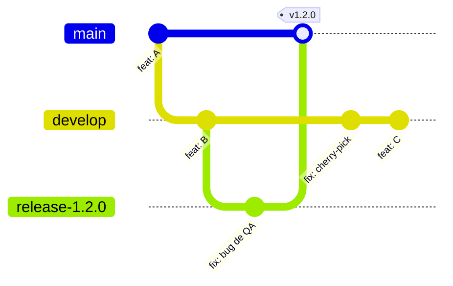
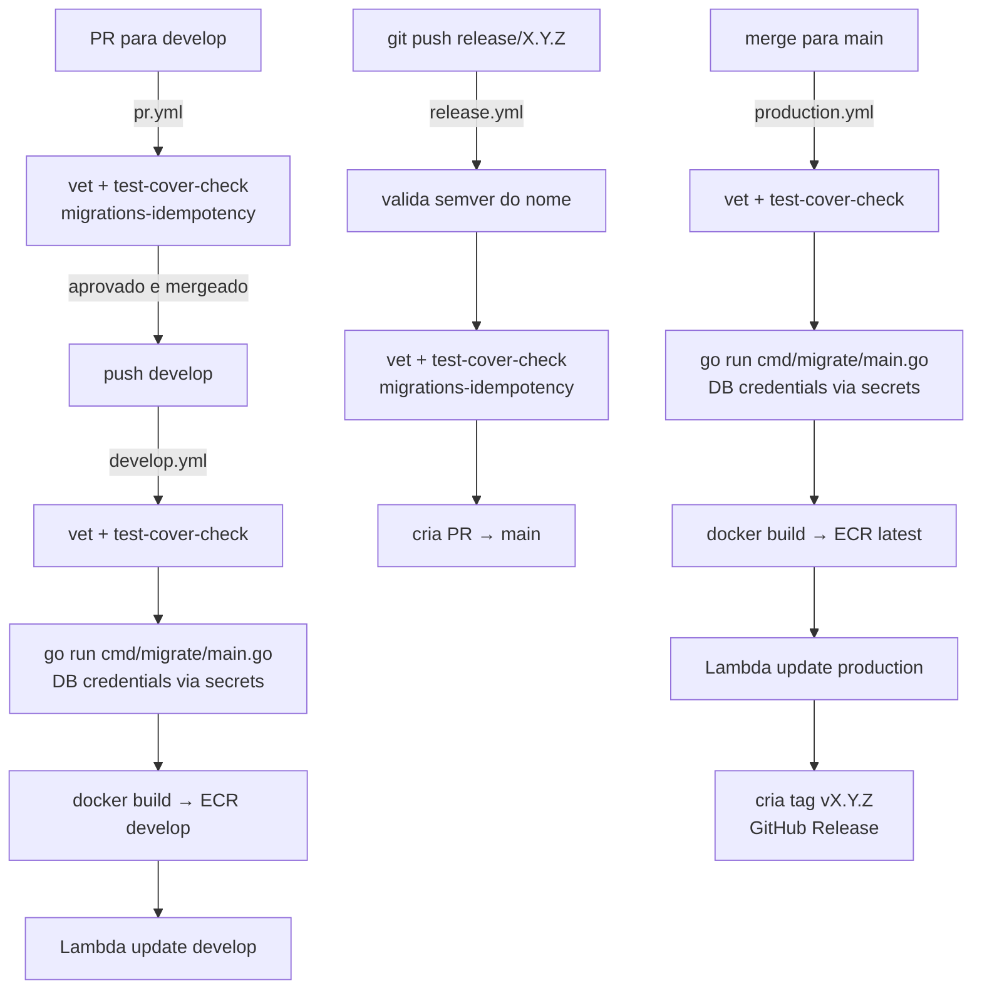
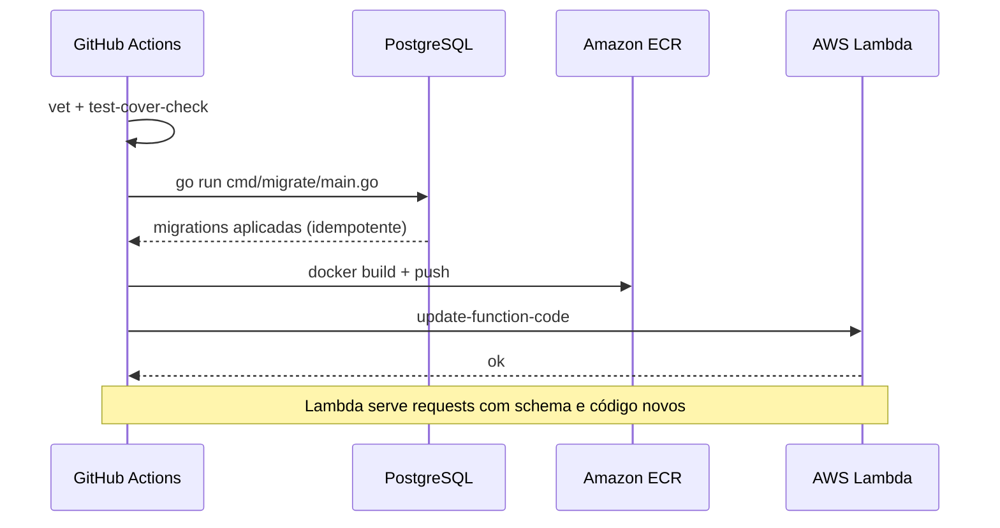

# Processo de Release — Nucleus API

## Princípios

| Branch | Invariante |
|--------|-----------|
| `develop` | Sempre **releasable** — qualquer commit deve poder virar uma release |
| `release/X.Y.Z` | Apenas bug-fixes de estabilização; nenhuma feature nova |
| `main` | Sempre **deployable** — representa o que está em produção |

---

## Versionamento Semântico

Use [Semantic Versioning](https://semver.org/) (`MAJOR.MINOR.PATCH`):

| Tipo de mudança | O que incrementar |
|-----------------|------------------|
| Breaking change (incompatível com a API pública) | `MAJOR` |
| Nova funcionalidade compatível | `MINOR` |
| Bug fix | `PATCH` |

---

## Fluxo Completo



---

## Esteira de CI/CD



---

## Passo a Passo

### 1. Verificar que develop está pronta

```bash
git checkout develop
git pull origin develop
```

Confirme que todos os PRs previstos para a versão foram mergeados e o ambiente develop está passando nos checks.

### 2. Criar a branch de release

```bash
git checkout -b release/X.Y.Z develop
git push origin release/X.Y.Z
```

O workflow `release.yml` dispara automaticamente e:
1. Valida o formato `release/X.Y.Z` (semver)
2. Roda: vet + test-cover-check + migrations-idempotency
3. Cria um **PR** de `release/X.Y.Z` → `main` com changelog automático

### 3. Estabilização (opcional)

Bug fixes encontrados em QA vão **direto na release branch**:

```bash
git checkout release/X.Y.Z
# ... corrigir bug ...
git commit -m "fix: corrige bug encontrado em QA"
git push origin release/X.Y.Z
# cherry-pick para develop também
git checkout develop
git cherry-pick <commit-hash>
git push origin develop
```

Cada push em `release/**` re-executa o workflow de validação.

### 4. Fechar a release

1. Abra o PR no GitHub
2. Certifique que todos os checks passaram
3. Solicite aprovação de pelo menos 1 reviewer
4. Mergee para `main`

O `production.yml` dispara e:
- Roda migrations contra o banco de produção (via secrets)
- Builda e publica imagem no ECR com tag `latest`
- Atualiza a Lambda de produção
- Cria tag `vX.Y.Z` e GitHub Release com changelog

### 5. Confirmar o deploy

```bash
git fetch --tags
git tag --sort=-version:refname | head -5
```

Confirme também que o workflow `production.yml` terminou com sucesso e que o GitHub Release `vX.Y.Z` foi criado.

### 6. Excluir a branch de release

Depois que o PR foi mergeado, o deploy de produção passou e a tag/GitHub Release foram criados, a branch `release/X.Y.Z` pode ser excluída:

```bash
git push origin --delete release/X.Y.Z
git branch -d release/X.Y.Z
```

Não exclua a branch antes de confirmar a pipeline e a tag. Se o deploy ou a criação da release falhar, mantenha a branch para correções rápidas ou novo rerun controlado.

---

## Ordem de operações na pipeline



A migration roda **antes** do deploy do Lambda: schema atualizado primeiro, código novo depois.

---

## Rollback

### Opção 1: Re-deploy da imagem anterior via Lambda Console

1. AWS Lambda Console → função de produção
2. **Image** → **Deploy new image**
3. Selecione a imagem ECR com a tag anterior (ex: `v1.1.0`)

### Opção 2: Reverter via hotfix

```bash
git checkout -b hotfix/X.Y.Z main
# ...fix...
git push origin hotfix/X.Y.Z
# Abra PR direto para main, sem passar por release flow
```

> Hotfixes críticos podem ir diretamente para `main` via PR sem criar branch `release/`. Use com parcimônia.

---

## Migrations na Pipeline

As migrations rodam via `go run cmd/migrate/main.go` com credenciais de DB dos GitHub Secrets do environment correspondente.

**Por que é seguro rodar duas vezes:**
- O registry é idempotente: verifica `schema_migrations` antes de cada migration
- O guardrail `TestMigrations_AreIdempotent` em CI garante que toda migration é idempotente antes de chegar ao banco

**Localmente:**
```bash
make migrate   # roda migrations (carrega .env automaticamente)
```

---

## Ambientes

| Ambiente | Branch | Trigger | Migrations |
|----------|--------|---------|-----------|
| Develop | `develop` | push automático | via pipeline (DB secrets) |
| Production | `main` | push automático | via pipeline (DB secrets) |

---

## Antipadrões

- **Não** adicione features em `release/**` — somente bug-fixes
- **Não** faça push direto para `main`
- **Não** mergee sem aprovação de reviewer
- **Não** pule develop — valide antes de criar a release
- **Não** crie migrations não-idempotentes — o guardrail vai pegar em CI
